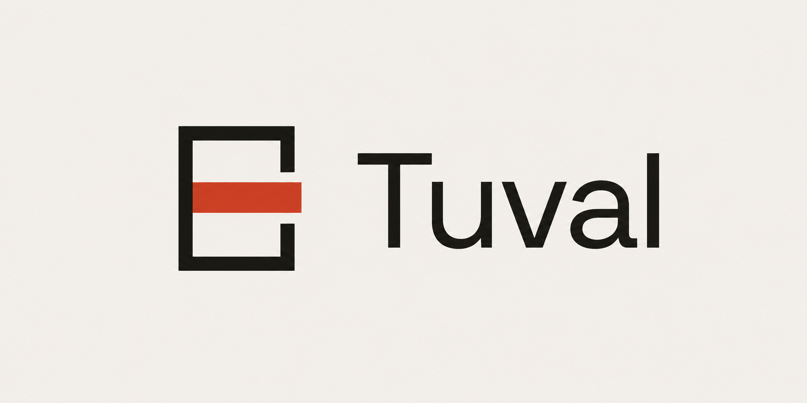

Open source infinite canvas. Canvas 2D renderer + Yjs CRDT, local-first, self-hostable.

An open alternative to Miro, FigJam and the like. All code, design and branding are our own;
no visual identity or asset is copied from any commercial product.

[Türkçe README](README.tr.md) · [Design system](DESIGN.md) · [Contributing](CONTRIBUTING.md)

## Why

Whiteboard, task board and document are three views of one workspace, not three products.
Tuval is the canvas view. It is meant to be used daily by a real team, self-hosted, without
a per-seat bill.

One thing here does not exist elsewhere: **Hand off to AI**. A board is reduced to a semantic
graph — frames become sections, connectors become directed edges, comments attach to the nearest
item, code blocks stay fenced code — and exported as a prompt, Markdown or JSON that a coding
agent can actually act on. Spatial layout is resolved into reading order, so the output is not
a screenshot but a brief.

The loop closes: paste an agent's Markdown back into **Build a board from a brief** and headings
become frames, bullets become stickies, fenced code becomes code blocks and a mermaid flow
becomes connectors.

## Boards

Every board is a room in the URL: `/b/team-board`. The grid icon in the top bar opens the
board list — create, search, switch, delete. The registry lives in `localStorage` and older
rooms are recovered from `indexedDB.databases()`, so a board you visited once is never lost to
a forgotten link. The list is per-browser: share the URL for someone else to open a board.

Your camera is remembered per board, so a refresh puts you back where you were.

## Cloud (optional)

Tuval is local-first and needs no backend. Add Supabase and boards leave the browser:
accounts, a board list shared across devices, images in object storage, and a document
snapshot kept server side.

1. Create a project at [supabase.com](https://supabase.com).
2. Apply [`supabase/migrations`](supabase/migrations). Either link the project once and let
   the CLI track what is applied:

   ```bash
   npx supabase link --project-ref <your-project-ref>
   npx supabase db push
   ```

   or paste the files into the SQL editor in filename order. Every migration is idempotent,
   so re-running one is harmless.
3. Put the project URL and anon key in `.env.local`:

```bash
VITE_SUPABASE_URL=https://xxxx.supabase.co
VITE_SUPABASE_ANON_KEY=eyJhbGciOi...
```

Sign-in is a magic link, so there are no passwords to store. Without the keys every control
disappears and nothing changes: the board list stays local and images stay inline.

Sharing is by email. The owner invites an address from the **Share** menu; the invite waits in
`board_invites` until that address signs in, at which point it becomes a membership. So you can
invite someone who has never opened Tuval. Roles are `editor` and `viewer`, enforced by row
level security rather than by the interface.

A board can also be opened to a whole email domain, so a team never has to be invited one by
one. The domain is never typed in: it is read from the owner's own verified address, which is
also why no DNS ownership check is needed.

Two knobs belong to whoever runs the instance, not to Tuval, and they live in
`public.tuval_settings`:

```sql
-- allow opening a board to any domain, not only your own
update tuval_settings set restrict_to_own_domain = false;

-- refuse domains outright, for example shared mailbox providers
update tuval_settings set blocked_domains = '{gmail.com,outlook.com,yahoo.com}';
```

Both are enforced by a trigger, so a client that talks to the API directly obeys them too.
The defaults are conservative: own domain only, nothing blocked.

The invite itself travels as a sign-in link, which is the only mail Supabase sends on your
behalf. Configure **Authentication → SMTP Settings** with your own server before relying on
it: the built-in sender is throttled to a handful of messages an hour and is not meant for
production. Editing the *Magic Link* template under **Authentication → Email Templates** is
worth the two minutes, since that is the text an invited colleague reads.

The document itself is still a Yjs CRDT. The snapshot is *merged* on open rather than
assigned, so a board edited offline on two machines converges instead of one side winning.

## Agent skill

`skills/tuval-board/SKILL.md` teaches a coding agent both directions of the format: how to read
a board export and how to write Markdown that Tuval can rebuild into a board. Install it with

```bash
npx skills add <owner>/<repo>@tuval-board
```

or copy the file into your agent's skills directory.

## Run

```bash
npm install
npm run dev            # app  → http://localhost:5173
npm run collab         # optional y-websocket server on :1234
```

For multiplayer put `VITE_COLLAB_URL=ws://localhost:1234` in `.env.local`, start the collab
server and restart the dev server (Vite reads env at boot). Open two tabs: items, selection
and live cursors sync. The board room comes from the URL: `http://localhost:5173/b/team-board`.

## Deploy

`npm run build` produces a static `dist/`. Any static host works; there is no server to run,
but `/b/<room>` and `/dashboard` are routes inside the app, so unknown paths have to be
answered with `index.html`. On Cloudflare that is `not_found_handling` in `wrangler.jsonc`;
elsewhere it is the usual SPA fallback.

After the site is up, point Supabase at it: **Authentication → URL Configuration**, set
Site URL to your origin and add it to Redirect URLs. Sign-in links break without this.

Multiplayer needs the y-websocket server hosted separately over `wss://` and
`VITE_COLLAB_URL` set at build time. Without it Tuval still saves to Supabase, boards just
do not update live between people.

## Architecture

Single `<canvas>` with a dirty-flag rAF loop. DOM overlays only where they earn it: text
editing, embeds, popovers. The document is a Yjs CRDT; persistence is IndexedDB, multiplayer
is y-websocket.

| File | Responsibility |
|---|---|
| `src/board/types.ts` | Item schema, palettes |
| `src/board/doc.ts` | Yjs document, CRUD, undo/redo, persistence, provider |
| `src/board/camera.ts` | Viewport transforms, zoom, fit |
| `src/board/geometry.ts` | Hit-testing, resize/rotate math, snapping, connector routing |
| `src/board/interaction.ts` | Pointer state machine |
| `src/board/render.ts` | Render pipeline, selection overlay, remote cursors |
| `src/board/paper.ts` | Surface colour and texture |
| `src/board/code.ts` | Syntax tokenizer for code blocks (no external highlighter) |
| `src/board/agent.ts` | Board → semantic graph → prompt / Markdown / JSON |
| `src/board/store.ts` | Zustand UI state + ephemeral session |
| `src/i18n.ts` | String catalogue; English is the source language |

High-frequency work (dragging) does not write to Yjs every frame; it accumulates in a local
preview layer and flushes every ~80 ms and on release.

Images are embedded as data URLs inside the CRDT, so they are downscaled to 1600px and
re-encoded to WebP before they are added. Files under 400 KB and 1600px are kept untouched.
Object storage is the real fix and is planned; until then every byte of an image replicates
to every peer and is kept in IndexedDB and in version snapshots.

## Shortcuts

| Key | Action |
|---|---|
| `V` `H` `N` `T` `S` `L` `P` `F` `C` | Select, Hand, Sticky, Text, Shape, Connector, Pen, Frame, Comment |
| `Space` + drag / middle click | Pan |
| `⌘` + wheel / trackpad pinch | Zoom to cursor |
| `⌘Z` / `⌘⇧Z` | Undo / Redo |
| `⌘D` `⌘C` `⌘X` `⌘V` `⌘A` | Duplicate, copy, cut, paste, select all |
| `⌘G` / `⌘⇧G` | Group / Ungroup |
| `⌘]` `⌘[` (with `⇧` for front/back) | Z-order |
| `⇧1` `⇧2` `⇧3` | Fit, zoom to selection, 100% |
| Arrow keys (`⇧` = 10px) | Nudge |
| `Tab` / `⇧Tab` | New item to the right / left of the selection |
| `⌘F` | Search the board (`↑↓` navigate, `↵` go) |
| `⌘⌥C` / `⌘⌥V` | Copy / paste style |
| `Alt` + drag | Duplicate while moving |
| `⇧` + resize | Keep ratio · `Alt` + resize: from centre |
| `⌘` + move | Disable snapping |

## Translating

English is the source language. `t('Some string')` looks the string up in
[`src/i18n.ts`](src/i18n.ts); a missing entry falls back to the English source, so a partial
translation is always safe. To add a language, copy the `tr` catalogue, translate the values
and register it in `CATALOG` and `LANGS`.

## Verifying changes

```bash
npx tsc -b --noEmit && npm test && npm run build
```

`npx tsc --noEmit` without `-b` checks nothing here: the root `tsconfig.json` is a solution
file with `"files": []`. It exits successfully and hides every error.

Tests cover the pure core: geometry (resize, snapping, connector bounds, frame title hit
area), the Markdown importer and the agent export including their round trip, the syntax
tokenizer, status labels, the board registry and camera memory. Rendering and pointer
handling are not covered; those are verified in the browser. CI runs the same four commands
on every push and pull request.

## License

[AGPL-3.0-or-later](LICENSE). Use, modify and self-host Tuval freely. If you run a modified
version as a network service, you must offer its source to your users.

### Changing the database

Migrations are append-only. Never edit a file that has been applied; add a new one:

```bash
npx supabase migration new what_changed
```

Write it so it can run twice (`create or replace`, `if not exists`, `drop policy if exists`),
because self-hosters apply these by hand.

### Signing in with Apple

GitHub and Google are a client id and a secret pasted into Supabase. Apple is not: it never
hands out a secret, you sign one yourself with the `.p8` key from the developer portal, and
Apple caps it at six months.

```bash
node scripts/apple-secret.mjs <team-id> <key-id> <services-id> AuthKey_XXXX.p8
```

Paste the output into **Secret Key (for OAuth)** under the Apple provider. Put a reminder in
the calendar for the expiry the script prints: nothing warns you when it lapses, sign-in
simply stops working.

## Coming from Miro

There is no lock-in on either side. Pull a board out of Miro and rebuild it here:

```bash
MIRO_TOKEN=xxx node scripts/miro-export.mjs <board-id> board.json
```

The token is created at *miro.com → Settings → Your apps* (a developer team app with
`boards:read`) and never leaves your shell: Tuval does not talk to Miro, and the browser
never sees the token.

Then **Hand off to AI → Build a board from a brief → Open a file** and pick the JSON.
Frames, sticky notes, text, shapes, images, cards and connectors come over; positions are
converted from Miro's centre origin to top-left, items keep their frame, and colours land on
the nearest tone of our palette rather than being copied. Anything unsupported is counted and
named in the panel instead of being dropped silently.
