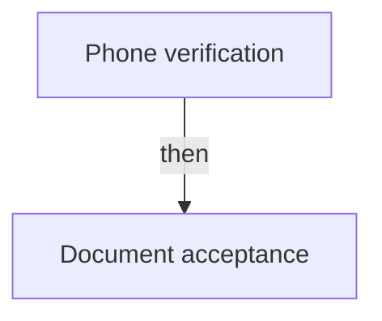

# MCP server

Tuval hands a board to an agent as a brief. This is the other direction: the agent goes and looks,
and — with a key made to write — files what it found.

Obsidian works as a second brain for agents because the notes are files an agent can open. Ours
are rows in a database, so this is the door. It speaks MCP over stdin and stdout, which is what
Claude Code and Cursor mount.

## Setup

```bash
claude mcp add tuval -- node /path/to/tuval/scripts/mcp.mjs
```

It needs a key from **Settings → API and webhooks**, in the environment or in `.env.local`:

```bash
TUVAL_API_KEY=tuv_...
TUVAL_API_URL=https://<project>.supabase.co/functions/v1/api   # optional
```

Without `TUVAL_API_URL` it is derived from `VITE_SUPABASE_URL`, so a checkout that already runs
the app needs one line.

The key carries the same limits as the [HTTP API](api.md): `team` plan, or a `self_hosted`
install.

## Tools

| Tool | What it does |
|---|---|
| `search` | Words in titles and bodies across pages, databases, issues and projects. Returns an excerpt and the id to read in full |
| `read_page` | One page or issue as Markdown, headings and lists intact |
| `list_records` | Records of one kind, filtered by status, assignee, project or cycle |
| `workspace` | What this key can reach, whether it may write, and how many writes it has left today |
| `create_record` | File an issue, a page, a project, a person, a company or an event |
| `update_record` | Change a title, status, assignee, priority, due date, parent, project or cycle |
| `append_to_page` | Add Markdown to the end of a page or issue |
| `create_board` | Open an infinite canvas drawn from a Markdown brief |
| `read_board` | What is drawn on a board, as prose: frames, reading order, the flow between items |
| `list_boards` | The boards in this workspace, with item and frame counts |
| `update_board` | Rename a board, or send it another brief: `append` under what is there, `replace` over what the last brief drew |
| `trash_board` | Put a board in the trash — marked rather than removed, so a person can restore it |

## Writing

The last six want a key whose scope is **write**. Scope is chosen when the key is made, in
Settings → API and webhooks; a `read` key answers `403` to every one of them and the server says so in
words rather than as a number. There is a daily allowance — 1000 writes by default — and past it
every write answers `429`, which is a different problem from `403` and worth telling apart: one
means come back with a better key, the other means come back tomorrow.

Every write is signed with the person the key speaks for and the key's own name, and leaves a
version behind that a person can put back. See
[what a write leaves behind](api.md#what-a-write-leaves-behind).

### Where `append_to_page` lands, exactly

A page's text is a CRDT, in `record_docs`, and only a browser can edit it. Neither this server nor
the HTTP API can open one. So `append_to_page` leaves the Markdown on the record, and the app
folds it in — the text becomes real paragraphs at the end of the page the next time somebody opens
that page in Tuval, with its headings, lists and code intact. Appending twice before anyone opens
it queues both, in order.

Until it is folded in:

- `read_page` reads it back, in the place it will take
- **search does not find it.** Postgres indexes the flattened copy of the document, and this text
  is not in the document yet, so neither `search` here nor ⌘K in the app will turn it up

Both stop being true the moment somebody opens the page. It is a delay, not a separate place, and
nothing is lost either way. If a promise you made depends on the text being findable right now,
say so.

### Reading one back

`read_board` answers from a copy, not from the document. The browser writes the reading beside the
snapshot every time it saves, the same way it writes a page's Markdown, because nothing outside a
browser can compose a CRDT. So a board somebody changed and has not saved reads as it last did,
and a board nobody has opened since this existed says it has no reading yet rather than answering
empty. The `X-Tuval-Read-At` header carries the date of the copy; if what you were asked depends
on the board being current, say which it is.

### Where `create_board` lands, exactly

The same bargain, for the canvas. A board is a CRDT too, so no server can place a sticky on one.
`create_board` opens the board and leaves the brief on its row; the first browser to open it turns
the brief into frames, notes and arrows and empties the column. Two people opening at once draw it
once.

The brief is Markdown with a shape, the one [`briefToItems`](../src/board/importer.ts) already
reads:

```markdown
# Legal compliance test

## Acceptance flow

- Phone verification
- Document acceptance

## Flow


```

The first heading names the board. Each `##` becomes a frame and its bullets become notes inside
it. A `## Flow` section holding a mermaid flowchart becomes the arrows: a node named with the same
words as a bullet lands on that note. A brief that draws nothing is cleared rather than retried on
every open.

The point of it is somebody who does not read issue lists: a tester, a client, anybody who would
rather look at a board and see what to try.

`body` and `markdown` are not writable, on the API or here, and will not become writable. They are
the flattened copies of the document that the browser writes beside it so Postgres has something
to index. A write to either would look like it worked and then vanish the first time somebody
opened the page and typed.

## Checking it works

```bash
echo '{"jsonrpc":"2.0","id":1,"method":"tools/list"}' | node scripts/mcp.mjs
```

Twelve tools come back. If the key is missing, the plan has the API off, the key may only read or
it has spent its writes, `tools/call` answers with the reason as text rather than a transport
error, so the model can read it and decide what to do.

## Related

- [HTTP API](api.md)
- [Agents](agents.md) — both directions, and where they stop
- [Self-hosting](self-hosting.md)
