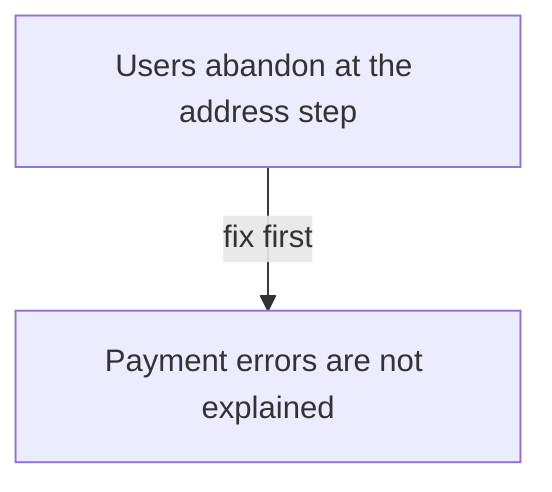
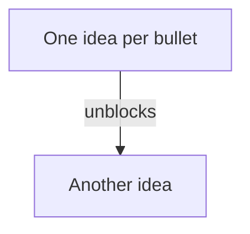

# Tuval boards

Tuval is an open source infinite canvas. It can hand a board to you as a brief, and it can
build a board back from a brief you write. Both directions use the same Markdown shape, so
producing that shape correctly means your answer can be pasted straight onto a canvas.

## Reading a board

A board arrives as Markdown. The spatial layout has already been resolved for you: reading
order is top to bottom, then left to right.

```markdown
# Board title

Infinite canvas export · 12 items · 2 frames · 3 connections

## Discovery
- Users abandon at the address step
- Payment errors are not explained

## Build
```ts
export function validateAddress(input: Address) { ... }
```

| Step | Owner |
| --- | --- |
| Address | Ada |

## Flow


## Comments
- On "Payment errors are not explained" — Ada: this blocks the sprint
```

How to interpret it:

| Markdown | On the canvas | Read it as |
|---|---|---|
| `## Heading` | a frame | a section, a column, a phase |
| `- bullet` | a sticky note | one idea, one card, one task |
| `- [Decision] bullet` | a sticky with a status chip | the author's state: Idea, Question, Doing, Blocked, Decision, Done |
| fenced code | a code block | real source, quote it exactly |
| pipe table | a table | structured data |
| `## Flow` mermaid | connectors | dependency, sequence, causality |
| `## Comments` | comment pins | someone's objection or note, weigh it |

The mermaid graph is the part people usually miss. `a --> b` means the author drew an arrow
on the canvas, so `b` depends on or follows `a`. Edge labels (`-- fix first -->`) carry the
author's reasoning. Order your answer by that graph, not by bullet order.

Items outside any frame appear under `## Outside frames`. Treat them as unsorted scratch,
not as a deliberate section.

## Writing a board

When the user wants your answer back on the canvas, emit exactly this shape. They paste it
into **Hand off to AI → Build a board from a brief** and it becomes real items.

```markdown
# Short board title

## First phase
- One idea per bullet
- Keep bullets under ~12 words; they render as sticky notes
- Multi-line detail goes on indented continuation lines
  like this second line

## Second phase
- Another idea

```python
def only_when_code_is_the_point():
    ...
```

| Column | Column |
| --- | --- |
| cell | cell |

## Flow

```

Rules that matter:

1. **One idea per bullet.** A bullet becomes a 228×228 sticky. A paragraph in a bullet becomes
   an unreadable sticky. Split it.
2. **Prefix a status when it carries meaning:** `- [Blocked] Payment vendor contract`. Use only
   `Idea`, `Question`, `Doing`, `Blocked`, `Decision`, `Done`. Omit it when the state is unknown;
   do not label every bullet.
3. **Frames are phases, not chapters.** 3–7 bullets per frame reads well; 30 does not.
4. **Declare mermaid nodes before using them** — `n1["Label"]` on its own line. The label must
   repeat the bullet's opening words so the importer can match the arrow to the right sticky.
   Unmatched labels fall back to position order, which is usually wrong.
5. **Only draw arrows that mean something.** Dependency, sequence, causality. Do not connect
   every node to the next one just to fill the graph.
6. **Do not invent `## Comments`.** Comments come from humans on the board.
7. **Code blocks stay code.** Do not turn source into bullets; the canvas renders code blocks
   with syntax colouring and line numbers.

## Round trip

The two directions are symmetric, which is the point: a board becomes a brief, you work on
the brief, your answer becomes a board again. When the user gives you an export and asks for
changes, return the **whole** modified Markdown, not a diff — they will rebuild from it.

If you are asked for something with no natural flow (a glossary, a list of options, meeting
notes), skip the `## Flow` section entirely. An empty or arbitrary graph is worse than none.
